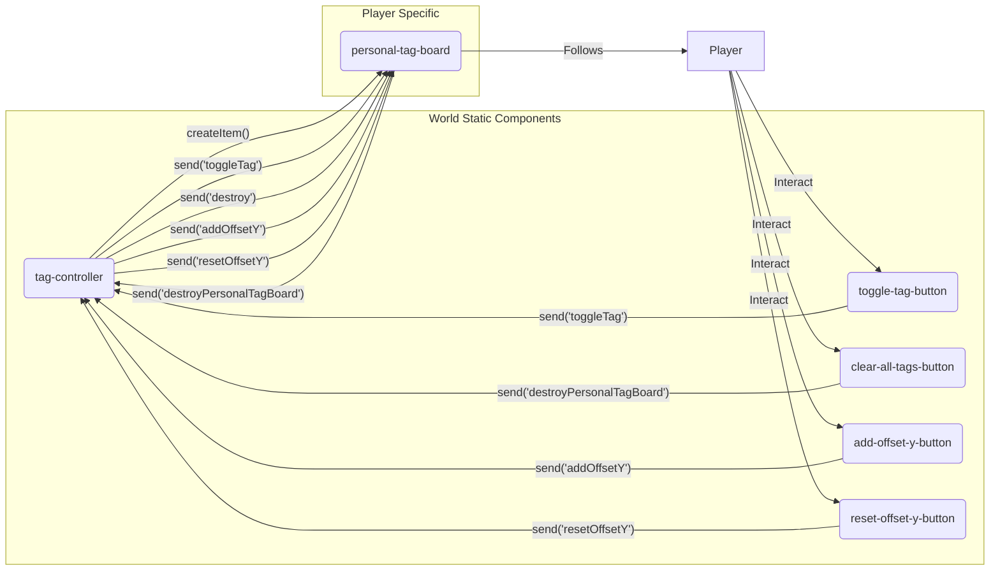
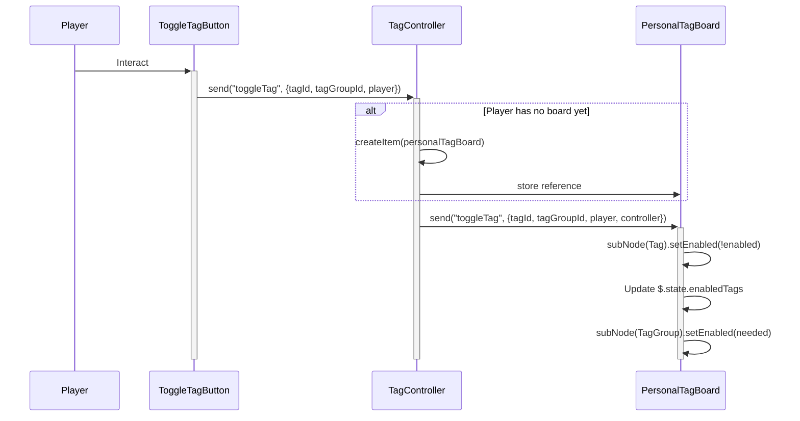

# アーキテクチャドキュメント

このドキュメントは、Cluster VR Easy Tag System スクリプトのアーキテクチャについて概説します。

## 概要

このシステムにより、プレイヤーは自身のアバターに付けられたビジュアルタグを切り替えることができます。各プレイヤーは、自身を追従するパーソナルタグボードを持ちます。ワールド内のボタンを使用すると、プレイヤーは特定のタグを切り替えたり、すべてのタグをクリアしたり (ボードを破棄することによって) 、タグボードの垂直オフセットを調整したりできます。

中央の `tag-controller` スクリプトが、各プレイヤーの個々の `personal-tag-board` インスタンスの作成と通信を管理します。さまざまなボタンスクリプト (`toggle-tag-button.ts`, `clear-all-tags-button.ts`, `add-offset-y-button.ts`, `reset-offset-y-button.ts`) は、インタラクション時に `tag-controller` にメッセージを送信します。

## コンポーネント

### 1. `tag-controller.ts`

*   **目的**: プレイヤーのタグボードを管理する中央ハブとして機能します。
*   **責務**:
    *   ボタンスクリプトからのメッセージ (`toggleTag`、`destroyPersonalTagBoard`、`addOffsetY`、`resetOffsetY`) をリッスンします。
    *   プレイヤーに関連するメッセージが到着したときに、そのプレイヤー用の `personal-tag-board` アイテムインスタンスが存在しない場合は新規に作成します。
    *   アクティブな `personal-tag-board` アイテムへの参照を、プレイヤーIDをキーとして `$.state.personalTagBoards` に保存します。
    *   ボタンから受信したメッセージを、対応するプレイヤーの `personal-tag-board` インスタンスに転送します。
    *   ボードが破棄されたときに、その状態から `personal-tag-board` の参照を削除する処理を行います。
*   **依存関係**: `personal-tag-board.ts` (テンプレートID用) 、`*-button.ts` (メッセージタイプ用) 。

### 2. `personal-tag-board.ts`

*   **目的**: プレイヤーにアタッチされた実際のタグボードアイテムを表します。
*   **責務**:
    *   このアイテムのサブノードであると想定される個々のタグ (`Tag${tagId}`) およびタググループ (`TagGroup${tagGroupId}`) の表示状態を管理します。
    *   `toggleTag` メッセージを受信して特定のタグを有効/無効にし、それに応じてタグとそのグループの表示状態を更新します。グループごとに有効なタグを `$.state.enabledTags` で追跡します。
    *   `addOffsetY` および `resetOffsetY` メッセージを受信して、プレイヤーに対する垂直位置を調整します。現在のオフセットを `$.state.offsetY` に保存します。アイテムの状態からデフォルトのオフセット (`defaultOffsetY`) を読み取ります。
    *   所有者プレイヤー (`$.state.owner`) とコントローラー参照 (`$.state.controller`) を保存します。
    *   `$.onUpdate` で、垂直オフセットを適用しながら、所有者プレイヤーに合わせて位置と回転を継続的に更新します。
    *   `destroy` メッセージを受信した場合、または所有者プレイヤーが見つからなくなった場合に、自身の破棄 (`$.destroy()`) を処理します。所有者の喪失により破棄された場合は `tag-controller` に通知します。
*   **依存関係**: `tag-controller.ts` (メッセージタイプ用) 、`clear-all-tags-button.ts` (メッセージタイプ用) 、`add-offset-y-button.ts` (メッセージタイプ用) 。

### 3. `toggle-tag-button.ts`

*   **目的**: インタラクションしたプレイヤーに対して特定のタグを切り替える、インタラクト可能なボタンアイテム。
*   **責務**:
    *   アイテムの状態 (`$.getStateCompat`) から `tagId` と `tagGroupId` を読み取ります。
    *   インタラクション時 (`$.onInteract`) に、`tagId`、`tagGroupId`、およびインタラクションした `player` を含む `toggleTag` メッセージを `tag-controller` に送信します。
*   **依存関係**: `tag-controller.ts` (アイテム参照用) 。

### 4. `clear-all-tags-button.ts`

*   **目的**: インタラクションしたプレイヤーのタグボードを削除する、インタラクト可能なボタンアイテム。
*   **責務**:
    *   インタラクション時 (`$.onInteract`) に、インタラクションした `player` の `destroyPersonalTagBoard` メッセージを `tag-controller` に送信します。
*   **依存関係**: `tag-controller.ts` (アイテム参照用) 。

### 5. `add-offset-y-button.ts`

*   **目的**: プレイヤーのタグボードに特定の垂直オフセットを追加する、インタラクト可能なボタンアイテム。
*   **責務**:
    *   アイテムの状態 (`$.getStateCompat`) から `offsetY` 値を読み取ります。
    *   インタラクション時 (`$.onInteract`) に、`offsetY` とインタラクションした `player` を含む `addOffsetY` メッセージを `tag-controller` に送信します。
*   **依存関係**: `tag-controller.ts` (アイテム参照用) 。

### 6. `reset-offset-y-button.ts`

*   **目的**: プレイヤーのタグボードの垂直オフセットをリセットする、インタラクト可能なボタンアイテム。
*   **責務**:
    *   インタラクション時 (`$.onInteract`) に、インタラクションした `player` の `resetOffsetY` メッセージを `tag-controller` に送信します。
*   **依存関係**: `tag-controller.ts` (アイテム参照用) 。

## コンポーネント間通信

## インタラクションフロー例：タグの切り替え

1.  `Player` が `toggle-tag-button` アイテムとインタラクトします。
2.  `toggle-tag-button` スクリプト (`$.onInteract`) が、設定された `tagId` と `tagGroupId` を読み取ります。
3.  `tagId`、`tagGroupId`、および `Player` ハンドルを含む `toggleTag` メッセージを `tag-controller` アイテムに送信します。
4.  `tag-controller` スクリプトがメッセージを受信します。
5.  `$.state.personalTagBoards` をチェックして、`Player` の ID に関連付けられた既存のボードがあるか確認します。
    *   ボードが存在しない場合、`$.createItem` を使用して新しい `personal-tag-board` アイテムを作成し、その参照を `$.state.personalTagBoards` に保存します。
6.  `tag-controller` は、 (必要であれば自身のハンドルを `controller` として追加して) `toggleTag` メッセージを適切な `personal-tag-board` アイテムインスタンスに転送します。
7.  `personal-tag-board` スクリプトがメッセージを受信します。
8.  対応するタグのサブノード (`Tag${tagId}`) を見つけ、その有効状態を切り替えます (`$.subNode(...).setEnabled(...)`) 。
9.  内部状態 (`$.state.enabledTags`) を更新して、グループ内でアクティブなタグを追跡します。
10. 親グループ (`TagGroup${tagGroupId}`) の有効状態を変更する必要があるかチェックします (例：無効だったがアクティブなタグが1つになった場合は有効にする、有効だったがアクティブなタグがなくなった場合は無効にする) 。
11. `personal-tag-board` は、`$.onUpdate` ループでプレイヤーを追従し続けます。